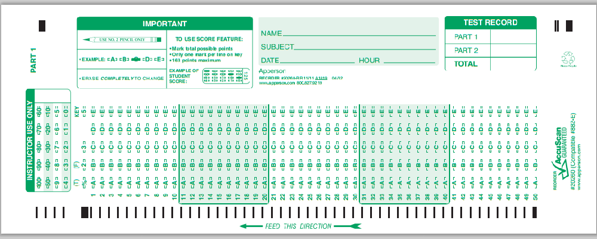

# CSUN Econ 160: Microeconomic Principles

# Fall 2023 Syllabus

# Table of Contents

- [Quick Syllabus](#quick-syllabus)
- [Tentative Schedule](#tentative-schedule)
- [Course Description](#course-description)
- [Course Materials](#course-materials)
- [Exam Policies and Information](#exam-policies-and-information)
- [Suggested Study Habits](#suggested-study-habits)
- [Additional Course Policies and Resources](#additional-course-policies-and-resources)

# Quick Syllabus

### Professor

- Dr. Edward Kung
- edward.kung@csun.edu

**About Me**: I love studying and teaching economics because it beautifully explains the world around us, from business and politics to dating and marriage. I also enjoy playing video games, and I'm learning to play guitar. I live in West LA with my wife and two kids.

### Lectures 

- Section 03 TuTh 9:30am - 10:45am @ Bookstein 1123
- Section 02 TuTh 12:30pm - 1:45pm @ Bookstein 1131

### Student Drop-In Hours (a.k.a. Office Hours)

- TuTh 2:00pm - 3:00pm @ Bookstein 4252

### Course Organization

This is an in-person class with two 75 minute sessions a week. The standard pattern will be a lecture on Thursdays, a discussion session on Tuesdays, and homework due on Mondays.

### Learning is a Journey

Before talking about grading, let me first say that learning is a journey and growth is the goal. If you finish each day knowing more than you knew before, then the day was successful. You should think of homework and tests as ways to measure your progress on the journey, not as gatekeepers barring your path. 

Nevertheless, grades are a part of life and necessary to your personal and career goals. I am here to help everyone attain the grade they desire, regardless of circumstance or background. If you need help at any time along your journey, please do not hesitate to get in touch. I am here to help. 

### Grading

- **Online Textbook Quizzes (30%)**
  - Due Mondays at midnight. You have unlimited attempts before the due date.
  - Submissions after the due date will be accepted but will receive a maximum of 60% credit. Late submissions are due by the last day of class.

- **In-class Quizzes and Attendance (30%)**
  - There will be a short (5-10 minutes) in-class quiz every Tuesday and sometimes on Thursdays.
  - The quizzes are administered on Canvas so bring a device capable of internet access.
  - Attendance will be checked on quiz dates. Life sometimes gets in the way, so you can miss up to 2 in-class quizzes for any reason. 
  - Further absences require a [valid reason](#late-and-missing-assignment-policy).
  
- **Midterm Exam (10%)**
  - An in-person, on-paper, multiple choice exam during one of the weekly sessions.
  - 90% will be considered full credit. Points above 90% will be counted as extra credit.

- **Practice Exam (5%)**
  - You will be required to take an online practice exam prior to the final. There will be unlimited attempts on this practice exam but it will be graded.
  
- **Final Exam (25%)**
  - An in-person, on-paper, multiple choice exam during finals week.
  - 90% will be considered full credit. Points above 90% will be counted as extra credit.

- **Grading Scale**
    
    |  A     |  A-   |  B+   |  B    |  B-   |  C+   |  C    |  C-   |  D    |  F   |
    | ------ | ----- | ----- | ----- | ----- | ----- | ----- | ----- | ----- | ---- |
    | 100-93 | 92-90 | 89-87 | 86-83 | 82-80 | 79-77 | 76-73 | 72-70 | 69-60 | 59-0 |
	
	Depending on the performance of the class, a curve may or may not be applied before assigning letter grades.

# Tentative Schedule

| Week  | Dates       | Tuesday                  | Thursday                             | Homework (due Mon) |
| ----- | ----------- | ------------------------ | ------------------------------------ | ------------------ |
|     1 | 8/28-9/1    | Ch.1: Introduction       | Ch.2: Decisions, Decisions           | Ch.2 Quiz          |
|     2 | 9/4-9/8     | Ch.2 Discussion          | Ch.3: Specialization and Trade       | Ch.3 Quiz          |
|     3 | 9/11-9/15   | Ch.3 Discussion          | Ch.4: Supply and Demand              | Ch.4 Quiz          |
|     4 | 9/18-9/22   | Ch.4 Discussion          | Ch.5: Using Supply and Demand        | Ch.5 Quiz          |
|     5 | 9/25-9/29   | Ch.5 Discussion          | Ch.6: Elasticity                     | Ch.6 Quiz          |
|     6 | 10/2-10/6   | Ch.6 Discussion          | Ch.7: Consumer and Producer Surplus  | Ch.7 Quiz          |
|     7 | 10/9-10/13  | Ch.7 Discussion          | Ch.8: Taxation                       | Ch.8 Quiz          |
|     8 | 10/16-10/20 | Ch.8 Discussion          | Ch.9: International Trade            | Ch.9 Quiz          |
|     9 | 10/23-10/27 | Ch.9 Discussion          | Ch.10: Public Goods                  | Ch.10 Quiz         |
|    10 | 10/30-11/3  | Midterm Exam             | Ch.11: Externalities                 | Ch.11 Quiz         |
|    11 | 11/6-11/10  | Ch.11 Discussion         | Ch.12: Costs of Production           | Ch.12 Quiz         |
|    12 | 11/13-11/17 | Ch.12 Discussion         | Ch.13: Perfectly Competitive Markets | Ch.13 Quiz         |
|    13 | 11/20-11/24 | Ch.13 Discussion         | *THANKSGIVING BREAK*                 |                    |
|    14 | 11/27-12/1  | Ch.14: Monopoly          | Ch.15 Monopolistic Competition       | Ch.14 & Ch.15 Quiz |
|    15 | 12/4-12/8   | Ch.14 & Ch.15 Discussion | Final Review                         | Practice Exam      |

### Final Exam Schedule

- Section 02: Thursday 12/14, 12:45pm - 2:45pm @ BH 1131
- Section 03: Tuesday 12/12, 8:00am - 10:00am @ BH 1123

# Course Description

### Prerequisites

Qualifying scores on ELM and EPT, or exemption, or satisfactory completion of appropriate developmental courses.

### Course Overview

Alfred Marshall once described economics as the "study of manking in the ordinary business of life." I can't think of a better description. Economics helps us understand everything from business and politics to marriage and dating. It is not just a field of study. It is a way of thinking that helps us understand the world and the people around us. I can't think of a better subject for future CEOs, politicians, and leaders. I can't think of a better subject for becoming a more informed citizen.

In this class, you will begin your journey to **thinking like an economist**. Primarily, this means being able to see how private incentives and market forces shape the way people behave and how societies are organized. The starting point will be supply and demand in competitive markets and its applications. We will then turn to more advanced topics, like public goods, externalities, and more complex market structures.

### Course Learning Outcomes

By the end of the course, you will be able to:

- **Explain** what the study of economics is and **discuss** the role of economic theory in shaping different views of markets and public policy.

- **Explain** the principle of supply and demand and explain why economists generally believe that free markets are an efficient way to allocate resources.

- **Explain** the circumstances under which free markets fail to allocate resources efficiently and **discuss** the role of government under these circumstances.

- **Analyze** the economic principles and forces that shape a variety of real-world scenarios and market structures.

- **Predict** and **calculate** equilibrium outcomes in a variety of real-world scenarios and market structures using the appropriate economic concepts and models.

# Course Materials

### Required Textbook

The required textbook is *Principles of Microeconomics* by Edward Kung (ISBN: 9781644967027). It is a digital textbook that can be purchased from [Great River Learning](https://www.grlcontent.com). Click on "purchase" and enter your institution (California State University, Northridge) and select "Principles of Microeconomics". Make sure you select the correct section! You should be enrolled in one of the two following sections:

- Fall 2023: Kung: Econ 160-02
- Fall 2023: Kung: Econ 160-03

You can also purchase access cards from the CSUN Bookstore.

### Calculator

A handheld calculator will be required for exams and some quizzes. Any kind of calculator is allowed, but you are not allowed to use programming and data storage capabilities of advanced calculators on exams.

### Video Lecture Series

A series of video lectuers I recorded during COVID is available free of charge. These are optional but may be a helpful supplement to the textbook chapters. They cover the same material as the textbook.

[Link to playlist](https://www.youtube.com/playlist?list=PL6ylNfxZ9nJRmytJD0DEVLScRQb0v0cL6)

# Exam Policies and Information

Both the midterm and final exam will be *in-person*, *on paper*, *multiple choice* exams. You will be required to bring:

- A Scantron Form 882 (both green and blue versions are fine) for marking your answers.

    

- A No.2 pencil for marking the scantron.
- An eraser for erasing mistakes.
- A calculator. Any kind of calculator is allowed but you are not allowed to use programming or data storage functionalities.
- Your CSUN ID card.

In addition, you are allowed to bring:

- A 3x5 inch index card of notes. You can fill out both the front and the back with any notes you wish.

Scratch paper is provided.

At the end of the exam, you will turn in both your scantron and your exam booklet. You will also show me your student ID to verify your identity.

# Suggested Study Habits

It is best to allocate 30 to 60 minutes a day towards studying and homework. Don't try to cram everything into one session. Our brains need time to digest information (I learned this from practicing guitar). Here's a suggested weekly schedule of 30-60 minute sessions:

1. Quick review of the chapter. Get started on the homework. Do as much as you can off the top of your head. Do not worry about getting everything right or understanding everything at this point.
2. Continue working on the homework, focusing on getting the problems you missed in the previous session and developing your understanding of concepts you struggle with.
3. Repeat until homework is complete with a score of 100% and mastery of the subject has been attained.

As for the final exam, I suggest taking more than one practice exam. Questions can change year by year. So if you only do one practice exam, you may not encounter a wide enough range of problems.

### Getting Help

The Business Honors Program at CSUN offers tutoring for Econ 160: https://www.csun.edu/nazarian-legacy-site/business-honors-program/tutoring.  Do not hesitate to seek tutoring resources, they are a normal part of the college experience.

However, if you need help I encourage you to come to my drop-in hours first, as I am usually able to explain things more clearly than a tutor.

  
# Additional Course Policies and Resources

### Communications Policy

My preferred form of communication is in-person after class or at drop-in hours, or by email. If you email me and I do not respond within 24 hours, do not hesitate to re-send the email. Sometimes emails get lost in the shuffle.

### Late and Missing Assignment Policy

Requests for late submissions or extensions, beyond what is allowed in the syllabus, must be submitted by email with accompanying documentation. Only unanticipated family or medical emergencies, or other extraordinary events, will be considered valid reasons. Events that could reasonably have been anticipated, such as heavy academic workload or busy work schedule, will not be accepted as valid reasons.

Special consideration may be given to students with caregiving responsibilities at home (children, disabled family members, etc.). Please get in touch with me if you need an extension and have caregiving responsibilities.

### Academic Integrity

By taking this course, you certify that all work is your own. Plagiarism is not allowed, and you are not allowed to have someone else do any course work in your place. If it is discovered that you have violated academic integrity on any assignment, you will receive a grade of zero for that assignment. Repeated violations of academic integrity may result in a failing grade for the entire course.

### Minimum Attempt Policy

You must at least attempt to answer every question on an assignment. If you skip a question without attempting an answer, you may receive a grade of zero for the entire assignment.

Why do I have a minimum attempt policy? Because demonstrating effort is important, especially in the workplace. Not even attempting an assignment is worse than attempting it and getting it wrong. I want to encourage all students to at least make an attempt at all tasks. As Kobe Bryant said, "You miss 100% of the shots you don't take."

### Students with Disabilities

If you have a disability or need special accommodations, please register with the Disability Resources and Educational Services ([DRES](https://www.csun.edu/dres)) office or the National Center of Deafness ([NCOD](https://www.csun.edu/ncod)). If you would like to discuss your need for accommodations with me, please contact me to set up an appointment.

### Emergency Food and Shelter

If you are experiencing an emergency need for food or shelter, do not hesitate to utilize the resources available to you on campus. More information: https://www.csun.edu/heart.

### University Counseling Services

If you have need for counseling regarding any personal or academic issues, do not hesitate to reach out to the University's counseling services. More information: https://www.csun.edu/counseling/students.

### Tutoring Services

Tutoring services may be available for this course. Please contact the Economics Department for information: https://www.csun.edu/economics.

### Diversity Statement

It is my intent that students from diverse backgrounds and perspectives will be well served by this course, that students' learning needs will be addressed both in and out of the classroom, and that the diversity students bring to the class will be viewed as a resource, strength, and benefit. It is my intent to present materials and activities in a way that is respectful to students from all backgrounds, and that students from all backgrounds have an equal opportunity to succeed in the course. If you have any concerns, feel free to reach out to me.

### All Other Policies

In general, the course follows all relevant CSUN policies and procedures as documented here: https://catalog.csun.edu/policies/alphabetical. Please pay special attention to the rules on **attendance** and **academic dishonesty**.

